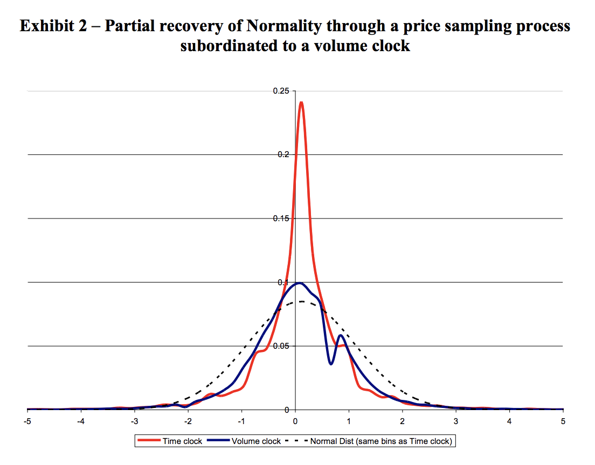
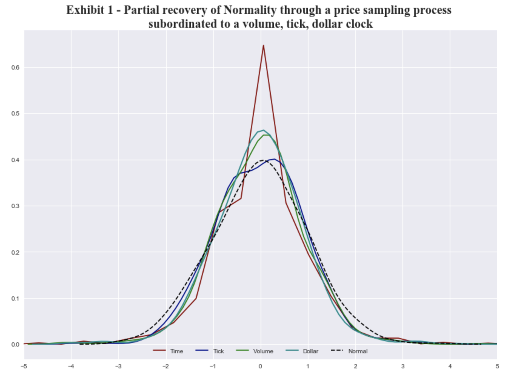

- Author: Jacques Francois Joubert
- Email: jacques@quantsportal.com
- Date: 7 May 2018 

# Create Financial Data Structures: Time, Tick, Volume, and Dollar Bars

Version of Pycharm Professional Edition: 2017.3

Version of Python: 3.6.5

## Description

This program is to help users create structured financial data from unstructured data, in the form of time, tick, volume, and dollar bars.

The user passes tick data to the create_bars(data, units=1000, type='tick') function and it returns the desired structured data.
Everything can be found in the main.py file. I left lots of comments in the code. 

These bars are used throughout the text book (*Advances in Financial Machine Learning, By Marcos Lopez de Prado, 2018, pg 25*)
to build the more interesting features for predicting financial time series data.

A great paper to read more about how the tick, volume, and dollar bars have better statistical properties to standard time sampled data is:
[The Volume Clock: Insights into the high frequency paradigm, Lopez de Prado, et al](https://papers.ssrn.com/sol3/papers.cfm?abstract_id=2034858)

Note: Please make sure you unzip the ES_Trades.csv.zip found in raw_tick_data, it was too big to upload without zipping it first.

## Why Using Different Sampling Techniques is Cool!
The whole motivation behind sampling data differently to the traditional fixed time intervals, is that alternative methods offer better statistical properties.

The following is from de Prado's text book:

Fixed time interval sampling should be avoided for 2 reasons: 
1. Markets don't process information at fixed time intervals, time bars oversample during quiet periods and undersample during busy periods.
2. Time sampled bars often exhibit poor statistical properties:
    - Serial Correlation
    - Heteroscedasticity
    - Non Normality of Returns

[Mandlebrot and Taylor [1967]](https://www.jstor.org/stable/168611?seq=1#page_scan_tab_contents) were among the first to realize that sampling as a function of the number of transactions exhibited desirable statistical properties.
Multiple studies have confirmed that sampling as a function of trading activity allows us to achieve returns closer to IID Normal [Ane and Geman [2000]](https://www.jstor.org/stable/222489)

This is important because many statistical methods rely on the assumption that observations are drawn from an IID Gaussian process.

In the paper titled 'The Volume Clock' you will see the authors show standardized distributions of fixed time intervals and volume bars.
Notice how the volume bars have a lower kurtosis. If you check the notebook you will see that the test statistics from the Jarque-Bera normality tests are much
lower for non fixed time bars. 

The code provided in this repo is some of the only code that de Prado doesn't offer in his text book and I thought that the community would find it useful
to have a repo from which they can access the code needed to build time, tick, volume, and dollar bars.

To show that the code is correct, I downloaded a small sample and plotted the same distribution.
20 days of tick data, E-mini S&P500 futures, 1 Sep 2013 to 20 Sep 2013.
(Sourced from Tick Data LLC: https://s3-us-west-2.amazonaws.com/tick-data-s3/downloads/ES_Sample.zip)

As you can see from the results, the alternative bar types provide better statistical properties. A deeper dive can be found in the notebooks.

## Data Analysis Jupyter Notebook
The following data analysis is performed on the series of E-mini S&P 500 futures tick data:

1. Form tick, volume, and dollar bars
2. Count the number of bars produced by tick, volume, and dollar bars on a weekly basis.
Plot a time seiries of that bar count. What bar type produces the most stable weekly count? Why?
3. Compute serieal correlation of returns for the three bar types. What bar method has the lowest serial correlation?
4. Apply the Jarque-Bera normality test on returns from the three bar types. What method achieves the lowest test statistic?
5. Standardize & Plot the Distributions

Notes:
- dir: jupyter_notebooks
- This Jupyter Notebook is labeled as DataAnalysis.ipynb
- Accompanying html file for ease of use 

## Installation on Mac OS X

Make sure you install the latest version of the Anaconda 3 distribution which must include an IDE like Spyder.
To do this you can follow the install and update instructions found on this link: https://www.anaconda.com/download/#mac

To install the package dependency run: pip install -r pip_requirements.txt

From Spyder or Pycharm IDE: Open the file main.py and run it.

From Terminal: 

1. Go to the directory where you have saved the file, example: cd Desktop/bars/awesome/
2. pip install -r pip_requirements.txt
3. Run the file: main.py (python main.py)

### Troubleshoot:
**error: no module named cython_loops**
You need to compile the cython module locally. cd into the working dir and in the terminal type: python setup.py build_ext --inplace

## Installation on Ubuntu Linux

Make sure you install the latest version of the Anaconda 3 distribution which must include an IDE like Spyder.
To do this you can follow the install and update instructions found on this link: https://www.anaconda.com/download/#linux

To install the package dependency run: pip install -r pip_requirements.txt

From Spyder or Pycharm IDE: Open the file main.py and run it.

From Terminal: 

1. Go to the directory where you have saved the file, example: cd Desktop/bars/awesome/
2. pip install -r pip_requirements.txt
3. Run the file: main.py (python main.py)

## Installation on Windows

A collegue of mine (Guillermo Izquierdo Colin) suggested the following for Windows users:
You can always use a virtualbox machine on Windows.

1. https://www.virtualbox.org/
2. Install an image of an Ubuntu or MacOS distribution
3. Install Anaconda3
4. Install Git
5. Clone repository
6. Build C packages, "python setup.py  build_ext --inplace"
7. and run the main.py  file.

The reason for this is because Windows doesn't lend itself well to python and cython. You need to wrestle a bear and then crawl on broken glass whilst humming Mozart's piano sonata no 13 in B flat major. Honestly, just install Linux. 

The following link is more useful for those pursuing the heroes journey: [How to deal with the pain of “unable to find vcvarsall.bat”](https://blogs.msdn.microsoft.com/pythonengineering/2016/04/11/unable-to-find-vcvarsall-bat/)

## Packages Used
Packages can all be installed by running the following command in the terminal (project working directory): "pip install -r pip_requirements.txt" 
* numpy==1.14.2
* pandas==0.22.0
* Cython==0.28.2

## Notes: 
* This program was built using a MacBook Pro on OS X.
* Python 3.6.5 was used
* Tested Successfully on both Mac OS X and Linux Ubuntu

## License (MIT)
The MIT License (MIT)

Copyright (c) 2018 Jacques Joubert

Permission is hereby granted, free of charge, to any person obtaining a copy
of this software and associated documentation files (the "Software"), to deal
in the Software without restriction, including without limitation the rights
to use, copy, modify, merge, publish, distribute, sublicense, and/or sell
copies of the Software, and to permit persons to whom the Software is
furnished to do so, subject to the following conditions:

The above copyright notice and this permission notice shall be included in all
copies or substantial portions of the Software.

THE SOFTWARE IS PROVIDED "AS IS", WITHOUT WARRANTY OF ANY KIND, EXPRESS OR
IMPLIED, INCLUDING BUT NOT LIMITED TO THE WARRANTIES OF MERCHANTABILITY,
FITNESS FOR A PARTICULAR PURPOSE AND NONINFRINGEMENT. IN NO EVENT SHALL THE
AUTHORS OR COPYRIGHT HOLDERS BE LIABLE FOR ANY CLAIM, DAMAGES OR OTHER
LIABILITY, WHETHER IN AN ACTION OF CONTRACT, TORT OR OTHERWISE, ARISING FROM,
OUT OF OR IN CONNECTION WITH THE SOFTWARE OR THE USE OR OTHER DEALINGS IN THE
SOFTWARE.
